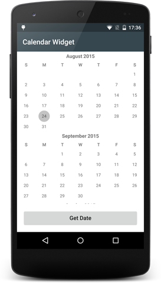

# Tabris.js Calendar Widget

A custom calendar widget for [Tabris.js](https://tabrisjs.com).

The widget provides basic support to show and pick a date.


## Plugin dependency

The Tabris.js project provides documentation on [how to use Cordova plugins](https://tabrisjs.com/documentation/latest/build#adding-plugins) in your projects. To include this calendar plugin you have to add a `<plugin>` element to your projects `config.xml`:

```xml
<plugin name="https://github.com/eclipsesource/tabris-calendar.git" />
```

## API

Widget name: `ESCalendar`

### Properties

The following properties can be applied on top of the [common Tabris.js properties](https://tabrisjs.com/documentation/latest/api/Widget#properties):

* `date` : _String_
 * The currently selected date as a unix timestamp in milliseconds

### Events

#### change:date

##### Parameter
* `widget`: _ESCalendar_
 * The widget the event happend on
* `date` : _String_
 * The new date as a unix timestamp in milliseconds

## Example

The following snippet shows how the widget can be used in an app:

```javascript
var page = tabris.create("Page", {
  title: "Calendar Widget",
  topLevel: true
});

tabris.create("Button", {
  id: "button",
  text: "Get Date",
  layoutData: {left: 16, right: 16, bottom: 16}
}).on("select", function() {
  var date = page.children("#calendar").get("date");
  console.log("date: " + new Date(parseInt(date)).toUTCString());
}).appendTo(page);

tabris.create("ESCalendar", {
  id: "calendar",
  date: new Date("October 13, 2014").getTime(),
  layoutData: {left: 0, right: 0, top: 0, bottom: "#button 16"}
}).on("change:date", function(widget, date) {
  console.log(new Date(parseInt(date)).toUTCString());
}).appendTo(page);

page.open();
```

## Compatibility

Compatible with [Tabris.js 1.2.0](https://github.com/eclipsesource/tabris-js/releases/tag/v1.2.0)

### Supported platforms

 * tabris-android

## Development of the widget

While not required by the consumer or the widget, this repository provides a `project` folder that contains platform specific development artifacts. These artifacts allow to more easily consume the native source code when developing the native parts of the widget.

### Android

The project provides a gradle based build configuration, which also allows to import the project into Android Studio.

In order to reference the Tabris.js specific APIs, the environment variable `TABRIS_ANDROID_CORDOVA_PLATFORM` has to point to the Tabris.js Android Cordova platform root directory.

```bash
export TABRIS_ANDROID_CORDOVA_PLATFORM=/home/user/tabris-android-cordova
```
 The environment variable is consumed in the gradle projects [build.gradle](project/android/build.gradle) file.

## Copyright

 See [LICENSE](LICENSE) notice.
